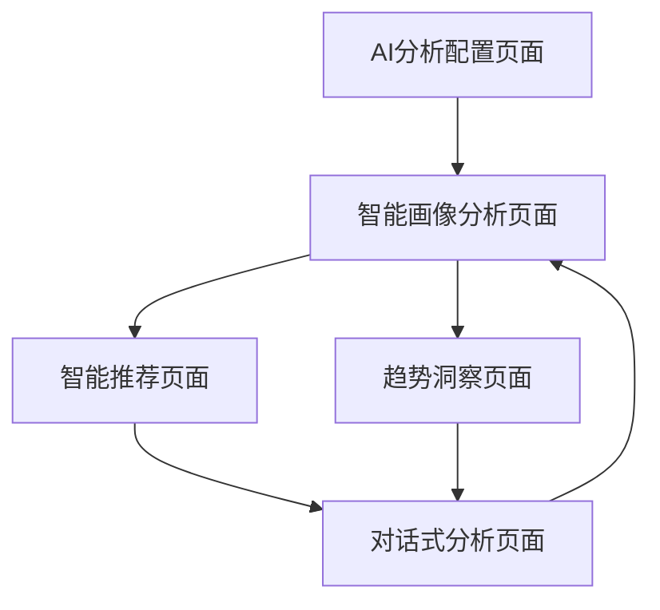

# AI增强用户画像分析系统产品需求文档

## 1. 产品概述

本系统通过集成DeepSeek、OpenAI等大模型API，为现有的用户画像分析功能提供AI增强能力，实现更智能、更深入的用户行为分析和个性化建议。

- 利用大模型的自然语言理解和生成能力，提供更准确的用户兴趣分析和内容推荐
- 通过AI驱动的洞察分析，帮助用户更好地理解自己的观看偏好和兴趣变化趋势
- 为B站内容创作者和普通用户提供个性化的关注建议和内容发现服务

## 2. 核心功能

### 2.1 用户角色

| 角色 | 注册方式 | 核心权限 |
|------|----------|----------|
| 普通用户 | 无需注册，使用现有B站数据 | 查看AI分析报告、获取个性化建议 |
| 高级用户 | 配置AI API密钥 | 使用高级AI分析、自定义分析维度 |

### 2.2 功能模块

我们的AI增强用户画像系统包含以下主要页面：

1. **AI分析配置页面**：AI模型选择、API密钥配置、分析参数设置
2. **智能画像分析页面**：AI驱动的用户兴趣深度分析、个性化标签生成
3. **智能推荐页面**：基于AI的关注建议、内容发现、兴趣拓展建议
4. **趋势洞察页面**：AI分析的兴趣变化趋势、行为模式识别
5. **对话式分析页面**：与AI助手对话，获取个性化分析和建议

### 2.3 页面详情

| 页面名称 | 模块名称 | 功能描述 |
|----------|----------|----------|
| AI分析配置页面 | 模型配置模块 | 选择AI模型（DeepSeek、OpenAI、Claude等）、配置API密钥、设置分析参数 |
| AI分析配置页面 | 隐私设置模块 | 数据使用授权、分析范围设置、结果保存选项 |
| 智能画像分析页面 | AI兴趣分析模块 | 使用大模型深度分析用户关注的UP主内容，生成详细的兴趣画像报告 |
| 智能画像分析页面 | 个性化标签模块 | AI生成的个性化兴趣标签、行为特征标签、内容偏好标签 |
| 智能画像分析页面 | 对比分析模块 | 与同类用户群体对比、兴趣独特性分析、小众兴趣发现 |
| 智能推荐页面 | 关注建议模块 | AI分析用户兴趣后推荐相关UP主、基于内容相似度的智能匹配 |
| 智能推荐页面 | 内容发现模块 | 推荐可能感兴趣的新领域、跨领域兴趣拓展建议 |
| 智能推荐页面 | 推荐解释模块 | AI解释推荐理由、提供详细的匹配分析 |
| 趋势洞察页面 | 兴趣演化分析 | AI分析用户兴趣随时间的变化趋势、预测未来兴趣方向 |
| 趋势洞察页面 | 行为模式识别 | 识别用户的观看习惯、活跃时间模式、内容消费偏好 |
| 趋势洞察页面 | 个性化报告 | 生成AI驱动的个人年度/月度兴趣报告 |
| 对话式分析页面 | AI助手对话 | 与AI助手自然语言对话，询问关于自己兴趣和推荐的问题 |
| 对话式分析页面 | 实时分析 | 基于对话内容实时调整分析结果和推荐策略 |

## 3. 核心流程

### 普通用户流程
用户访问智能画像分析页面 → 系统使用默认AI模型分析现有数据 → 生成基础AI分析报告 → 查看智能推荐和趋势洞察

### 高级用户流程
用户配置AI API密钥 → 选择偏好的AI模型 → 设置分析参数 → 获取深度AI分析 → 使用对话式分析功能 → 导出个性化报告

## 4. 用户界面设计

### 4.1 设计风格

- **主色调**：深蓝色(#1a365d)和AI蓝(#3182ce)，体现科技感和智能化
- **辅助色**：渐变紫色(#805ad5)和绿色(#38a169)，突出AI功能
- **按钮样式**：圆角设计，带有微光效果，体现AI的未来感
- **字体**：主要使用微软雅黑，代码部分使用等宽字体
- **布局风格**：卡片式布局，支持响应式设计，AI分析结果采用对话气泡样式
- **图标风格**：使用AI相关的图标，如机器人、大脑、星星等

### 4.2 页面设计概览

| 页面名称 | 模块名称 | UI元素 |
|----------|----------|--------|
| AI分析配置页面 | 模型配置模块 | 下拉选择器、API密钥输入框、配置状态指示器、测试连接按钮 |
| 智能画像分析页面 | AI兴趣分析模块 | 分析进度条、结果展示卡片、可视化图表、AI洞察文本框 |
| 智能推荐页面 | 关注建议模块 | UP主推荐卡片、匹配度评分、推荐理由展示、一键关注按钮 |
| 趋势洞察页面 | 兴趣演化分析 | 时间轴图表、趋势预测曲线、关键节点标注、AI分析摘要 |
| 对话式分析页面 | AI助手对话 | 聊天界面、消息气泡、快速问题按钮、语音输入支持 |

### 4.3 响应式设计

产品采用移动优先的响应式设计，支持桌面端和移动端访问，针对触屏设备优化交互体验，AI对话界面特别优化了移动端的输入体验。