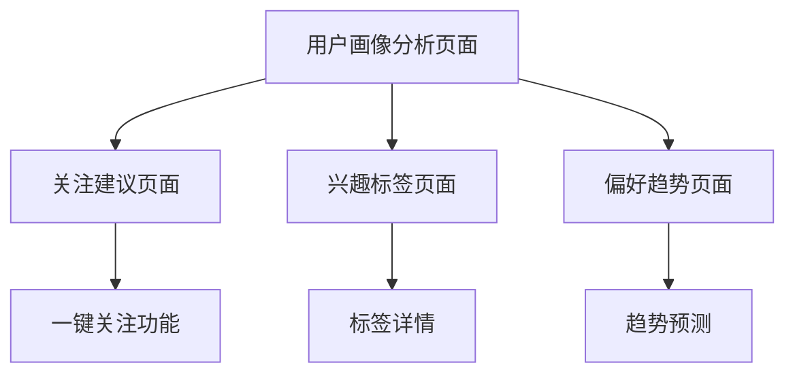

# 用户画像与建议功能需求文档

## 1. 产品概述

本文档定义了哔哩哔哩批量操作工具中用户画像与建议功能的详细需求。该功能旨在基于用户关注的UP主数据，分析用户兴趣偏好，生成个性化的用户画像，并提供智能的关注建议。

## 2. 核心功能

### 2.1 用户角色

| 角色 | 注册方式 | 核心权限 |
|------|----------|----------|
| 普通用户 | 配置B站Cookie | 可查看个人画像分析、获取关注建议、查看兴趣标签 |

### 2.2 功能模块

我们的用户画像与建议功能包含以下主要页面：
1. **用户画像分析页面**：兴趣偏好分析、关注分布统计、用户行为洞察
2. **关注建议页面**：相似用户推荐、推荐理由展示、一键关注功能
3. **兴趣标签页面**：个人兴趣标签云、标签权重显示、标签趋势分析
4. **偏好趋势页面**：兴趣变化趋势图、时间轴分析、预测建议

### 2.3 页面详情

| 页面名称 | 模块名称 | 功能描述 |
|----------|----------|----------|
| 用户画像分析页面 | 兴趣偏好分析 | 基于关注UP主的分类数据，分析用户在各领域的兴趣分布，生成兴趣偏好雷达图 |
| 用户画像分析页面 | 关注分布统计 | 统计用户关注的UP主在不同分类中的数量分布，展示饼图和柱状图 |
| 用户画像分析页面 | 用户行为洞察 | 分析用户关注时间、关注频率等行为特征，提供个性化洞察 |
| 关注建议页面 | 相似用户推荐 | 基于用户兴趣偏好，推荐具有相似兴趣的其他UP主 |
| 关注建议页面 | 推荐理由展示 | 为每个推荐的UP主提供详细的推荐理由和相似度分析 |
| 关注建议页面 | 一键关注功能 | 提供快速关注推荐UP主的功能，支持批量操作 |
| 兴趣标签页面 | 个人兴趣标签云 | 基于关注数据生成个性化的兴趣标签云，标签大小反映兴趣强度 |
| 兴趣标签页面 | 标签权重显示 | 显示每个兴趣标签的权重值和计算依据 |
| 兴趣标签页面 | 标签趋势分析 | 分析兴趣标签随时间的变化趋势 |
| 偏好趋势页面 | 兴趣变化趋势图 | 展示用户兴趣偏好随时间的变化曲线 |
| 偏好趋势页面 | 时间轴分析 | 提供详细的时间轴视图，显示关注行为的时间分布 |
| 偏好趋势页面 | 预测建议 | 基于历史趋势预测用户未来可能感兴趣的内容领域 |

## 3. 核心流程

### 用户画像分析流程
1. 用户访问用户画像分析页面
2. 系统读取用户关注的UP主数据
3. 基于UP主分类信息计算兴趣偏好
4. 生成兴趣偏好雷达图和分布统计
5. 展示用户行为洞察和个性化建议

### 关注建议流程
1. 用户访问关注建议页面
2. 系统分析用户兴趣偏好
3. 匹配相似兴趣的其他UP主
4. 计算推荐理由和相似度
5. 展示推荐列表和一键关注选项

## 4. 用户界面设计

### 4.1 设计风格

- **主色调**：#409EFF（蓝色）、#67C23A（绿色）
- **辅助色**：#E6A23C（橙色）、#F56C6C（红色）
- **按钮样式**：圆角按钮，支持悬停效果
- **字体**：微软雅黑，主标题16px，正文14px，说明文字12px
- **布局风格**：卡片式布局，顶部导航，响应式设计
- **图标风格**：使用Bootstrap Icons，简洁现代

### 4.2 页面设计概览

| 页面名称 | 模块名称 | UI元素 |
|----------|----------|--------|
| 用户画像分析页面 | 兴趣偏好分析 | 雷达图组件，使用ECharts渲染，支持交互式悬停，配色方案采用渐变蓝色系 |
| 关注建议页面 | 推荐列表 | 卡片式布局，每个UP主一张卡片，包含头像、用户名、推荐理由、关注按钮 |
| 兴趣标签页面 | 标签云 | 动态标签云组件，标签大小和颜色反映权重，支持点击交互 |
| 偏好趋势页面 | 趋势图表 | 时间序列图表，使用Chart.js渲染，支持缩放和筛选功能 |

### 4.3 响应式设计

产品采用移动端优先的响应式设计，支持桌面端和移动端访问，针对触摸交互进行优化。